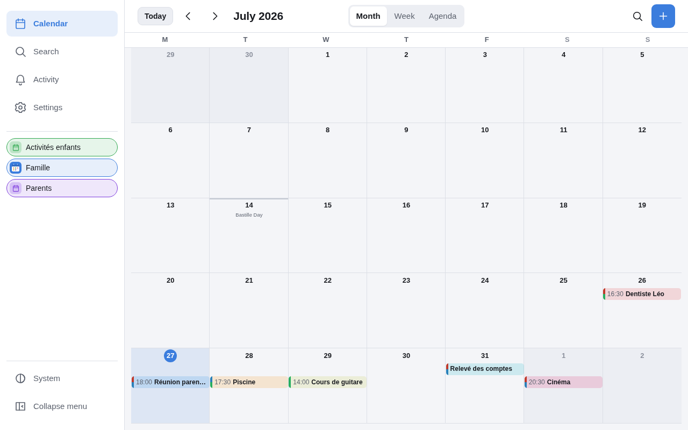
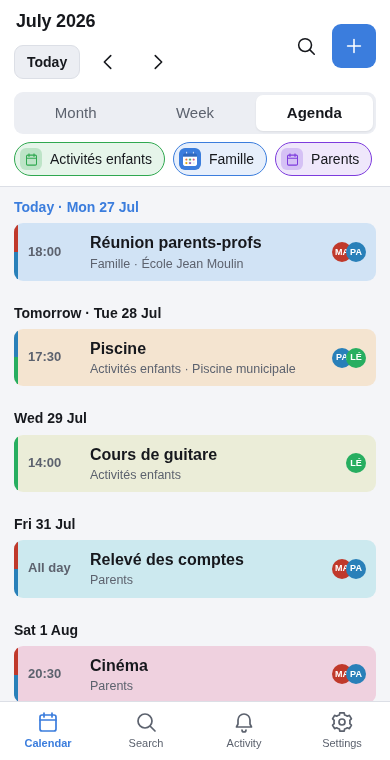
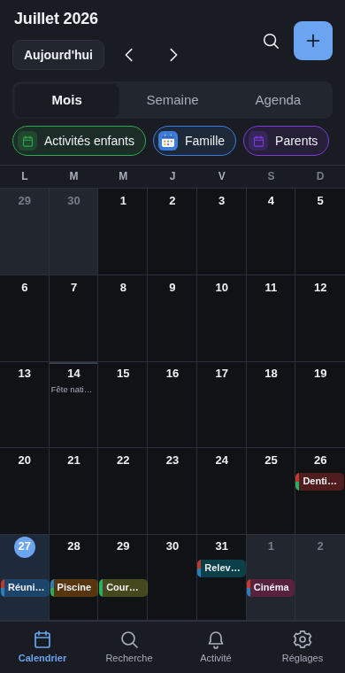

# Almanack

**A shared calendar with a ten-year shelf life.**

Host it yourself, for a family, a five-a-side team, a book club — any small group that
needs to agree on when things happen. Inspired by [TimeTree](https://timetreeapp.com),
built to run on a cheap box in a cupboard and keep working there for years without
attention.

One static Go binary. One SQLite file. A hand-written PWA with no build step.



```sh
make seed && make dev          # http://localhost:8080 — mum@example.org / password
```

That is the entire setup. [Go 1.25+](https://go.dev/dl/) is the only prerequisite —
no npm, no Docker, no database server, no API keys.

## What you get

- **Shared calendars** with month, week and agenda views, and per-calendar filters.
- **Recurring events** that behave: daily/weekly/monthly/yearly with intervals, "2nd
  Tuesday", "last day of the month", and proper *this / this and following / the whole
  series* editing.
- **Reminders** delivered by Web Push and email, set per person — creating an event
  never sets reminders for anyone else.
- **A daily digest** at a time each person chooses.
- **Colour by label or by person**, so a glance tells you whose appointment it is.
- **Installable PWA** with offline reading, plus public holidays and full French and
  English translation.
- **Invite-only signup** by shareable link. No open registration.

<p align="center">
  
  
</p>

## Why it looks like this

The design goal was not features, it was **not needing maintenance**. A shared calendar
that breaks while you are busy is worse than no calendar, and a hobby project you have to
babysit gets abandoned.

- **Two direct Go dependencies**, and zero in the browser. No framework, no bundler, no
  CDN, no web fonts. `deps_test.go` fails the build if that changes.
- **Everything in one binary** — the PWA is embedded with `go:embed`, so deploying is
  copying a file.
- **SQLite**, whose file format is supported through 2050 and whose backup is a file copy.
- **Web Push written from the RFCs** (8030/8291/8292) rather than pulled from a library,
  and verified against the RFC's own published test vectors.

The trade-offs, and the things this deliberately does *not* do, are in
[docs/architecture.md](docs/architecture.md).

## Is this for you?

**Probably yes** if you want a small shared calendar for people who know each other, you
are happy running a Go binary behind a reverse proxy, and you would rather read code you
can hold in your head than trust a container you cannot.

**Probably not** if you need CalDAV so events appear in the stock iPhone calendar, or
Outlook/Google sync, or per-event chat and photo albums, or more than a few dozen users.
Those are deliberate omissions rather than a roadmap — see the architecture document.

## Running it for real

```sh
make build                                        # a single static binary, ~13 MB
./almanack gen-vapid                                # push keys: once per deployment, never rotated
cp almanack.conf.example /etc/almanack/almanack.conf    # every setting lives in this one file
./almanack --config /etc/almanack/almanack.conf bootstrap --email you@example.org --name "Your name"
./almanack --config /etc/almanack/almanack.conf serve
```

You supply a reverse proxy with TLS (HTTPS is not optional — Web Push and PWA install
both refuse an insecure origin) and a local mail relay. The binary handles migrations,
readiness signalling, a watchdog and verified backups.

[docs/deployment.md](docs/deployment.md) is the contract: what the binary provides, and
what your deployment must provide. There is deliberately **no** Ansible role or Compose
file here — the config file is in systemd `EnvironmentFile` format so it drops straight
into whatever you already use.

## Documentation

| Document | What it covers |
|---|---|
| [docs/development.md](docs/development.md) | Running and testing locally, including notifications with no push service and no mail server |
| [docs/architecture.md](docs/architecture.md) | How it is built and why, the data model, and the rules that keep dates correct |
| [docs/api.md](docs/api.md) | The HTTP API, normative for both the server and the browser |
| [docs/known-issues.md](docs/known-issues.md) | What is broken or missing, reproduced and written down — the list to help from |
| [docs/deployment.md](docs/deployment.md) | What an operator must provide |
| [docs/migrating-from-timetree.md](docs/migrating-from-timetree.md) | Getting your data out of TimeTree, which has no export |
| [CONVENTIONS.md](CONVENTIONS.md) | Binding rules for code in this repo |
| [CONTRIBUTING.md](CONTRIBUTING.md) | How to propose a change |

## Status

Working and in use, but young: version 0.2, one household, no upgrade history yet. The
test suite is thorough where correctness is hard — recurrence and daylight saving, the
notification outbox, the push encryption — and what it covers is described in
[docs/development.md](docs/development.md).

If you run it, issues and pull requests are welcome. If you fork it into something better
for your group, that is the point.

## How this was written

Almanack was vibe coded, end to end, with [Claude Code](https://claude.com/claude-code)
running Claude Opus 5. The Go, the JavaScript, the SQL, the commit messages and these
documents all came out of that; a human set the goals, pushed back on the results and
decided what shipped.

That is said here rather than left to be worked out, because it should change how you read
the rest of this page. Treat the claims about correctness as claims, and check them against
the things you can actually run: `make check`, the recurrence and daylight-saving tests, the
Web Push vectors taken from the RFCs, and [docs/known-issues.md](docs/known-issues.md) —
which is what an adversarial review found and reproduced, not what the author hoped was true.

## Licence

[AGPL-3.0](LICENSE). If you run a modified version as a service for other people, they
are entitled to your changes.
